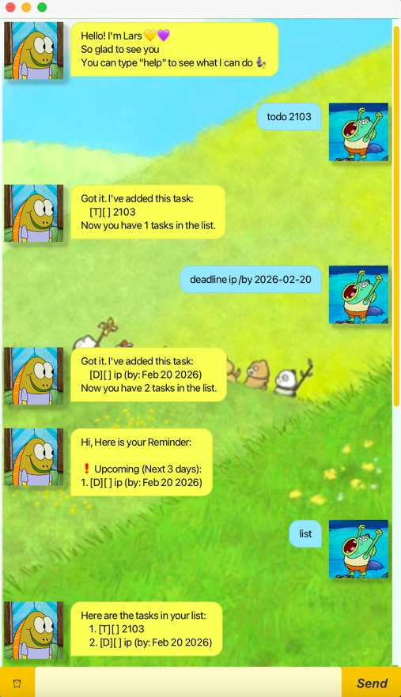

# ip
# Lars User Guide 💛💜
Lars is a friendly, interactive chatbot designed to help users manage tasks, deadlines, and events efficiently.

This guide will show you how to interact with Lars and make the most of its features.
## Quick Show

## Getting Started
Prerequisites:
-    For windows: **JDK 17**
-    For Mac: **Java 17 JDK+FX Azul distribution**
1. Download the **jar** file from the Releases page.
2. Open a **terminal** in the jar file location.
3. Launch the application 
   - double-click the `.jar` file 
   - run via terminal with `java -jar lars.jar`
2. You will see a **welcome** message from Lars.
3. Tip: Type `help` anytime to see a list of supported commands.

## Features

### Quick Review

| Feature | Format |
|---------|--------|
| Help | `help` |
| List | `list` |
| Todo | `todo <description>` |
| Event | `event <description> /from <start> /to <end>` |
| Deadline | `deadline <description> /by <yyyy-mm-dd>` |
| Mark | `mark <index>` |
| Unmark | `unmark <index>` |
| Delete | `delete <index>` |
| Remind | `remind` or click the `⏰` button |
| Bye | `bye` |

## More Details

### 1. Help - View all commands
Displays the full list of available commands and their formats.  

**Format**  
`help`

### 2. List - List all tasks
Displays every task currently in your list.  

**Format**  
`list` 

### 3. Todo - Add tasks
Adds a task without any date/time constraints.  

**Format**  
`todo <description>`  
**Example**  
`todo 2103`

### 4. Event - Add events
Adds a task with a start and end time.

**Format:**  
`event <description> /from <start> /to <end>`  
**Examples:**  
1.  `event project meeting /from Mon 2pm /to 4pm` (Day and Time)
2.  `event music festival /from 2026-05-01 /to 2026-05-04` (Specific Dates)
3.  `event birthday party /from tonight /to late night` (Relative Time)

### 5. Deadline - Add tasks with deadline
Adds a task that needs to be done by a specific date.

**Format:**  
`deadline <description> /by <yyyy-mm-dd>`  
**Examples:**  
`deadline ip /by 2026-02-20`

### 6. Mark / unMark - Update task status
Marks a specific task as completed or incomplete.

**Format:**  
- `mark <index>`  
- `unmark <index>`  

**Examples:**  
- `mark 1`  
- `unmark 1`

### 7. Delete - remove tasks
Permanently deletes a task from the list.

**Format:**  
`delete <index>`  
**Examples:**  
`delete 2`  

### 8. Remind - Check urgent tasks  
Shows tasks that are overdue or approaching their deadline.  

**Format:**  
- `remind`
- Clink the `⏰` button

### 9. Bye - Exit the program
Closes the application.

**Format:**  
`bye`

## Project Status
Feature-complete    
Actively maintained  
